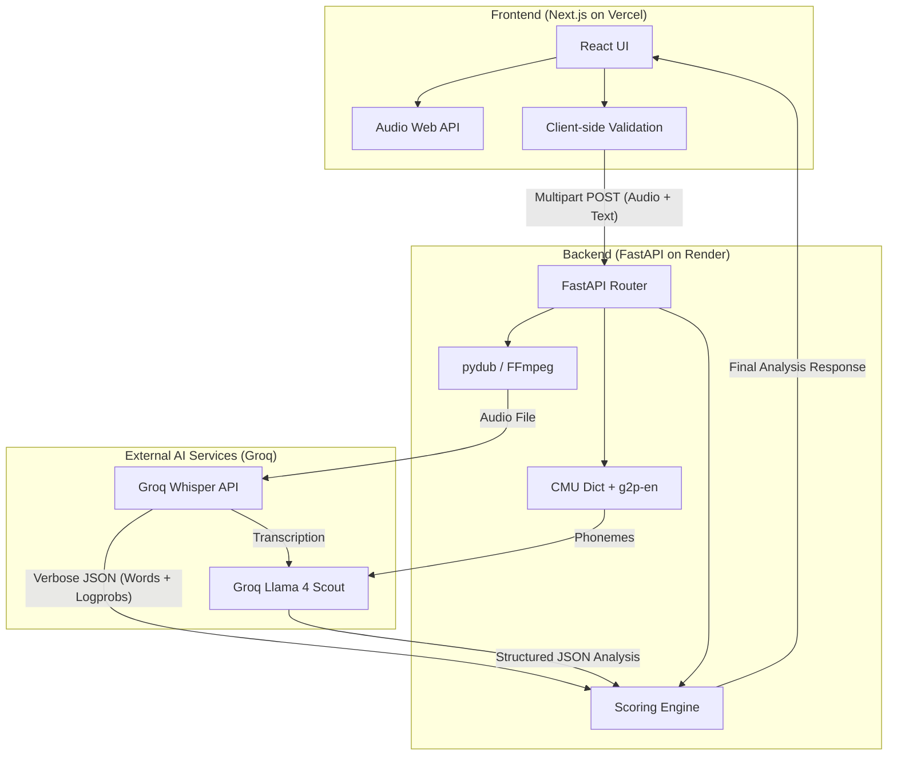

# System Architecture & DPDP Compliance

## Architecture Overview

SpeakScore is a full-stack web application designed for real-time pronunciation analysis. It separates the frontend presentation layer from the heavy audio processing and AI inference on the backend.

### Component Diagram

### Model Choices & Trade-offs

| Component | Choice | Alternative Considered | Why This Choice? |
|-----------|--------|-------------------------|------------------|
| **STT Engine** | **Groq Whisper** (`whisper-large-v3`) | OpenAI Whisper API, Deepgram | Groq provides the fastest inference on the market, word-level timestamps, and a generous free tier (2,000 req/day). OpenAI's API costs money. |
| **LLM Engine** | **Groq Llama 4 Scout** | Gemini 3.5 Flash, Claude 3.5 Sonnet | Groq's Llama 4 is lightning fast and free. It natively supports structured JSON output which is crucial for our deterministic parsing. |
| **Phoneme Analysis** | `pronouncing` + `g2p-en` | Montreal Forced Aligner (MFA) | MFA is computationally heavy and requires complex setup. For a fast web app, dictionary lookup with G2P fallback is significantly faster and sufficient for LLM context. |
| **Backend** | **FastAPI (Python)** | Node.js / Express | Python has vastly superior audio processing (`pydub`) and ML libraries. FastAPI is async-native, handling concurrent audio uploads efficiently. |
| **Deployment** | **Vercel + Render** | AWS / GCP | Vercel provides zero-config Next.js hosting. Render provides a free tier that supports Python/FastAPI natively. |

## Pronunciation Scoring Methodology

We use a **Multi-Signal Pipeline** because no single metric is reliable enough on its own:

1. **Acoustic Confidence (Whisper `avg_logprob`)**: Whisper provides a log probability score for segments. Low scores (<-0.5) strongly correlate with mumbled or mispronounced speech.
2. **Text Alignment**: We compare the transcribed text against the expected reference text. Mismatches highlight exact locations of substitutions, insertions, or deletions.
3. **Phonemic LLM Expert**: We convert both expected and transcribed words into ARPAbet phonemes, then feed them to Llama 4. The LLM acts as an expert, identifying exactly *which sound* was mispronounced based on the phoneme delta.

**Final Score Calculation**: `(60% Accuracy) + (40% Fluency/Acoustic Confidence)`

## DPDP Act 2023 Compliance Posture

As an Indian app handling voice data, compliance with the **Digital Personal Data Protection Act 2023** is a first-class architectural concern.

1. **Explicit Consent Mechanism**: 
   - Users are blocked from uploading audio until they explicitly accept the Data Privacy Consent modal.
   - Consent is clear, specific, and states exactly how the audio is used.
2. **Zero-Retention Policy (Storage & Deletion)**: 
   - Audio is NEVER stored in a database or cloud bucket.
   - It is temporarily saved to disk using Python's `tempfile` during validation.
   - A `finally` block in the API route guarantees the temporary file is deleted immediately after processing, even if the request fails.
3. **Data Minimization**:
   - The API returns only aggregate text scores and feedback. No audio is returned or persisted.
4. **Data Residency & Cross-Border Transfer**:
   - Audio is transmitted to Groq Inc. (USA) for processing.
   - This cross-border transfer is currently permissible under DPDP, and we explicitly disclose this in the Privacy Policy page.

## Future Improvements (With More Time)

If granted another week, I would build:
1. **Local Forced Alignment**: Integrate Wav2Vec2 or MFA to get precise phoneme-level timestamps and GOP (Goodness of Pronunciation) scores locally, removing reliance on Whisper's coarser segment logprobs.
2. **Real-time Streaming**: Move from `multipart/form-data` uploads to WebSockets, streaming audio chunks to the backend and Groq for sub-second latency feedback.
3. **Auth & Progress Tracking**: Add Supabase auth to let users track their pronunciation improvement over time securely.
